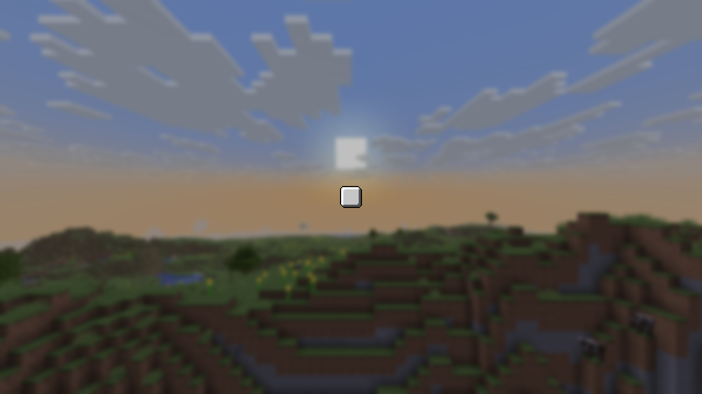
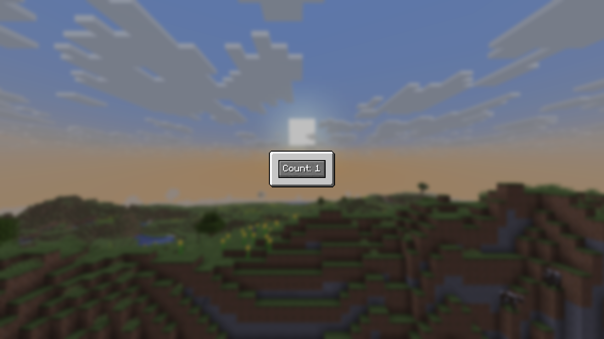
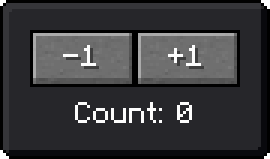
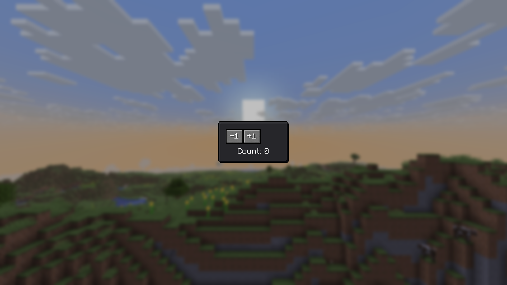
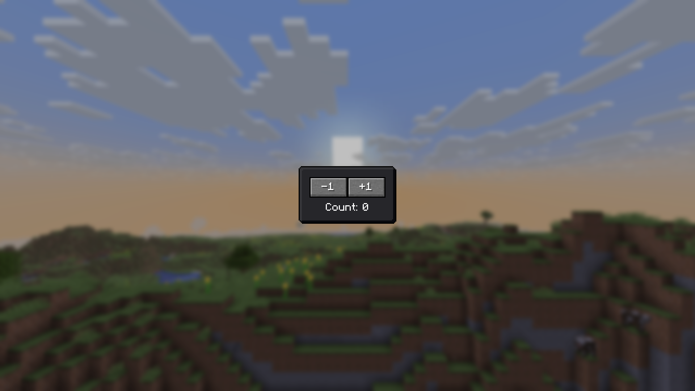

# Getting Started

To introduce you to developing with braid, we'll develop a trivially simple counter widget and then modularize it to introduce some other vital concepts of the library. If you want to reference the final code of the widget in both steps, check the [samples in the repository](https://github.com/wisp-forest/owo-lib/tree/braid-ui/src/testmod/java/io/wispforest/owo/samples/braid).

## A trivial counter

To start making the counter widget, we will first create the widget skeleton:

```java
public class SimpleCounter extends StatefulWidget {
    @Override
    public WidgetState<SimpleCounter> createState() {
        return new State();
    }

    public static class State extends WidgetState<SimpleCounter> {

        @Override
        public Widget build(BuildContext context) {
            return EmptyWidget.INSTANCE;
        }
    }
}
```

Now there are a few things to unpack, let's go through them in order:
- Our `SimpleCounter` is a `StatefulWidget` - this, along with its stateless counterpart (`StatelessWidget`) is the most common type of widget you'll find yourself authoring. We pick the stateful variant here because our counter must certainly keep track of some state (i.e. the current count it's on) in order to be useful.

  Now, we *cannot* simply store this state on the widget itself because, as part of braid's central design, widgets themselves are generally short-lived - they get used until the next time their parent's or ancestor's `build` method is called and then replaced. Thus, if we stored our count state on the widget, it would be reset the next time the an ancestor of the widget rebuilds.

  Instead, the library asks stateful widgets to create a state object the first time they appear at a certain location in the widget tree (this is what the `createState` function is for). This state is kept alive until there is no longer a widget of the same type at this location in the tree, and has access to the *current* widget it is configured with. In general, you want to think of widgets as *configuration* - they are merely little bundles of data responsible for specifying what their part of the UI is meant to look and work like *right now*.

- The inner `State` class which holds the long-lived state of our part of the UI contains the actual `build` method of our new counter widget. This is where we must return more widgets to describe to braid what the counter is supposed to look like and what it is supposed to do. That too is an important part of braid's design - UIs are built by composition, combining existing widgets into new widgets where they work together to create a fully-fledged UI component, an abstraction or some low-level library concept.

  The `build` method also always receives a `BuildContext` parameter which is an abstract representation of the location in the widget tree at which the widget is being (re)built. We won't need this for now, but it's a surprise tool that will help us later.

  Furthermore, the state also has a bunch of lifecycle hooks like `init`, `didUpdateWidget` and `dispose`, which get called by the library and are of vital importance for reacting properly to configuration changes (i.e. widget changes) induced by the parent.

Very well then, we can get started with adding our first actual widgets into the build method, like so:
```java
@Override
public Widget build(BuildContext context) {
    // the functionality of the center widget is trivial:
    // it takes up all available space and centers its
    // child within that space
    return new Center(
        // panels draw nine-patched textures to support
        // displaying at arbitrary sizes - here we use
        // the normal, light background as seen in
        // vanilla inventories
        new Panel(
            Panel.VANILLA_LIGHT,
            // the padding widget too is simple: it adds the
            // specified insets (dead space) around its child
            // (here, the zero-sized empty widget) and potentially
            // squishes its child a little when it would run
            // out of space otherwise
            new Padding(
                Insets.all(10),
                EmptyWidget.INSTANCE
            )
        )
    );
}
```

At this point, you likely want to try out the code we have written so far to see the results in game. To do this, we make use of the `BraidScreen` provided by the library. This screen accepts a widget it should display (in our case, the `SimpleCounter`) as well as an optional settings bundle which can be used to customize some aspects of the screen's behavior as a Minecraft screen.

```java
var screen = new BraidScreen(new SimpleCounter());
```

To display the screen, you can choose between any number of methods - running a client command, interacting with a block, interacting with an item, receiving a packet - all you need is a call to `MinecraftClient.setScreen`. For instance, assuming you want to use a client command, you'd use something like this in your client initializer:
```java {4-8}
ClientCommandRegistrationCallback.EVENT.register((dispatcher, registryAccess) -> {
    dispatcher.register(
        // register a /open-counter command which opens the screen
        ClientCommandManager.literal("open-counter")
            .executes(context -> {
                var screen = new BraidScreen(new SimpleCounter());
                MinecraftClient.getInstance().send(() -> MinecraftClient.getInstance().setScreen(screen));
                return 0;
            })
    );
});
```

::: warning Common command pitfall
Be aware that client commands (as you should be using for opening screens) execute *before* the chat screen closes. In practice this means that if you open a screen in the execute block of your command as you'd intuitively do, the chat screen will try to close itself by closing the client's current screen (which at that point will be *your* screen) immediately after your command has executed and you'll never actually see anything.

To remedy this, you can simply use the pattern from the code block above and send a task to the client which opens your screen with a slight delay so that it can be opened after the chat screen has closed.
:::

{ .docs-image }

Brilliant! A 20x20 vanilla panel, centered on the screen - just as we requested.

Let's continue by actually adding the functionality we're looking for. To do this, we'll first need to create a field which will store our state, like so:
```java
public static class State extends WidgetState<SimpleCounter> {

    private int count = 0; // [!code ++]

    @Override
    public Widget build(BuildContext context) { ... }
}
```

With this, we can modify the build method by replacing the `EmptyWidget` we used as a placeholder earlier with a button. Specifically, we'll be using the `MessageButton` which (as the name suggests) displays a message like a vanilla button would. This is preferable over the normal `Button` widget since we'd need to pass a widget into that instead of text - we could use a `Label` to achieve the same effect (and if you inspect the `MessageButton` implementation you'll find that that's exactly what it does), but let's not make it overly complicated.
```java
@Override
public Widget build(BuildContext context) {
    return new Center(
        new Panel(
            Panel.VANILLA_LIGHT,
            new Padding(
                Insets.all(10),
                EmptyWidget.INSTANCE  // [!code --]
                new MessageButton(  // [!code ++]
                    Text.literal("Count: " + this.count), // [!code ++]
                    () -> this.setState(() -> { // [!code ++]
                        this.count++; // [!code ++]
                    }) // [!code ++]
                )
            )
        )
    );
}
```

The button takes two arguments:
- The first is rather self-explanatory: a `Text` object which will be displayed on the button. We directly use the `count` variable we added to state earlier - this is possible because, as you remember, braid simply re-runs the entire `build` method whenever your state changes.
- The second is a callback which will be invoked whenever the button is clicked - this where we want to actually perform the counting logic. To do that, we invoke `setState` to notify the framework that we're about to mutate the state and increment the count variable in the closure which we must pass to it.

  Using `setState` here is of absolutely vital importance - without it, the framework would be none the wiser and would never rebuild our widget. You can easily try this yourself: increment count without using `setState`. You'll find that the count displayed by the button doesn't update.

  As a rule of thumb, whenever a piece of your state is used by the build method, you must use `setState` when mutating it. It is convention to only wrap the actual field updates in the call to `setState` to make it clear to readers which state is being mutated and when.

Next, assuming you have [set up the braid reload agent](hot-reloading.md), hot reload your code - the button will immediately appear. If not, either hot reload or restart your game and then reopen your screen.

{ .docs-image }

You can find the complete code of this section in `SimpleCounter.java`.

## Modularizing the Counter

Having built a basic widget and already introduced a lot of important basics, we'll move on to exploring some other techniques tools provided by the library. To motivate this, imagine you wanted to add more functionality to the counter - i.e. returning more widgets from its build method. You could of course simply make a bigger and bigger build method - this, however, is generally not ideal since it can have a negative impact on performance.

With a widget as simple as the counter we've built this is obviously not a concern (and generally, always remember to not optimize prematurely), but with more complicated build methods it can be unnecessarily expensive to re-run the entire thing and thus rebuild everything just because a single value changed somewhere. All of the layout-related widgets for example (like the `Center` and `Padding`) are not concerned with the current state of the counter and thus have no reason to be re-built each time.

Instead, it'd be nice if we could extract just the parts which need rebuilding (in this case, just the button) and have it still function correctly. To better demonstrate this process of sharing state between multiple widgets, we'll also display the count separately using a new widget.

Now, since child widgets are generally re-created by the `build` method on a state change we can simply pass state down the widget tree by giving it as a parameter to any descendants that need it. This, however, doesn't actually allow us to avoid re-running the parent's build method *and* it can quickly get cumbersome if there is more than one widget to ferry the state through. There are certainly many situations where this is a perfectly appropriate thing to do, but state which concerns larger parts of your app is often better kept in a `SharedState`.

Thus, to get started, we'll first create our state class. We'll use a static inner class inside our counter widget class:
```java
public static class CounterState extends ShareableState {
    public int count = 0;
}
```

Then, since we now store our state separately, we can convert our widget to stateless one (and also rename, so you don't get lost):
```java
public class SimpleCounter extends StatefulWidget { // [!code --]
public class SharedCounter extends StatelessWidget { // [!code ++]

    @Override // [!code --]
    public WidgetState<SimpleCounter> createState() { // [!code --]
        return new State(); // [!code --]
    } // [!code --]

    @Override // [!code ++]
    public Widget build(BuildContext context) {  ...  } // [!code ++]
}
```

As you can see, instead of a `createState` function, stateless widgets provide the `build` method directly since there is no need to go through an intermediate like the `WidgetState` object in the stateful case. `StatelessWidget` also lacks any functionality to cause a rebuild of itself, highlighting the importance of making all fields of `Widget` subclasses final and treating them as deeply immutable - even if you changed them somehow, there would be no way to get those changes rendered.

Next, let's create the two new widgets we wanted, starting with a label to display the current count. Just like our shareable state, we'll make these static inner classes of the `SharedCounter` - although you could just as well move them somewhere else.
```java
public static class CountLabel extends StatelessWidget {
    @Override
    public Widget build(BuildContext context) {
        var count = SharedState.get(context, CounterState.class).count;

        // convenience constructor, equivalent to
        // new Label(Text.literal("Count: " + count))
        return Label.literal("Count: " + count);
    }
}
```

Aha! This is where the build context finally comes in handy: we can use `SharedState.get` to look up the nearest instance of `CounterState` provided by an ancestor, in constant time no matter how far away that ancestor might be in the widget tree. Of course we haven't set up such an instance yet, but we'll do so soon. Looking up the state in this fashion also sets up some machinery in the background which causes the framework to rebuild this widget (and any others with the same dependency) whenever the state it depends upon changes.

For the button, we'll something a bit different from the simple counter and make the increment customizable:
```java
public static class CountButton extends StatelessWidget {

    public final int countBy;

    public CountButton(int countBy) {
        this.countBy = countBy;
    }

    @Override
    public Widget build(BuildContext context) {
        return new MessageButton(
            this.countBy > 0
                ? Text.literal("+" + this.countBy)
                : Text.literal(String.valueOf(this.countBy)),
            () -> SharedState.set(
                context, CounterState.class,
                state -> state.count += this.countBy
            )
        );
    }
}
```

As with the label, we can use `SharedState.set` to update the nearest instance of `CounterState` in just the same fashion we would using `setState` inside a widget state instance. In fact, if you wanted to, you could even just get the state using `SharedState.getWithoutDependency` and call its `setState` method. This is not ideal though, since it doesn't communicate intent as well and you should only use it in cases where you already have the state through some other means.

Finally, let's build out `SharedCounter.build` again:
```java
@Override
public Widget build(BuildContext context) {
    return new Center(
        new Panel(
            Panel.VANILLA_DARK,
            new Padding(
                Insets.all(10),
                // Sized takes a width and a height (both optional) and
                // constrains its child to exactly those dimensions
                new Sized(
                    70,   // 70 pixels wide
                    null, // leave height unconstrained
                    new SharedState<>(
                        CounterState::new,
                        EmptyWidget.INSTANCE
                    )
                )
            )
        )
    );
}
```

Here is where we use the `SharedState` widget to inject an instance of `CounterState` into our widget tree. We must give it a constructor to call when it first initializes the state (this works much like the `createState` method on stateful widgets) and a child. Internally, `SharedState` is actually a stateful widget which manages the lifecycle of this `CounterState` object for us and makes it available to its descendants.

Let's take a peek at the layout we're trying to create:
{ .docs-image }

To achieve this, we must make use of some extra layout widgets we haven't encountered yet. In order to arrange the buttons next to one another we can use a `Row` and to stack the buttons on top of the label, we can use a `Column`. Let's try that:
```java
@Override
public Widget build(BuildContext context) {
    return new Center(
        new Panel(
            Panel.VANILLA_DARK,
            new Padding(
                Insets.all(10),
                new Sized(
                    70,
                    null,
                    new SharedState<>(
                        CounterState::new,
                        EmptyWidget.INSTANCE // [!code --]
                        new Column( // [!code ++]
                            new Row( // [!code ++]
                                new CountButton(-1), // [!code ++]
                                new CountButton(1) // [!code ++]
                            ), // [!code ++]
                            new Padding( // [!code ++]
                                Insets.top(5), // [!code ++]
                                new CountLabel() // [!code ++]
                            ) // [!code ++]
                        )
                    )
                )
            )
        )
    );
}
```

Taking a peek in-game we see the following:
{ .docs-image }

That's not really what we wanted. However, it makes perfect sense: The flex widgets (row and column) let their children be any size on their so-called "main axis" (horizontal for `Row` and vertical for `Column`). So, even though we forced the column (and consequently the row) to be 70 pixels wide horizontally, both buttons ended up just a wide as they need to be.

To fix this, we must wrap both of the buttons in a `Flexible` widget, like so:
```java
new Column(
    new Row(
        new Flexible( // [!code ++]
            new CountButton(-1)
        ), // [!code ++]
        new Flexible( // [!code ++]
            new CountButton(1)
        ) // [!code ++]
    ),
    new Padding(
        Insets.top(5),
        new CountLabel()
    )
)
```

The `Flexible` widget can only be used inside a row, column or raw `Flex` widget and tells the parent to divide the space which remains after laying out all non-flexible children between the flexible ones. You could also make just one of the buttons flexible to see this in action. Either way, with these changes we have the desired result:
{ .docs-image }

You can find the complete code of this section in `SharedCounter.java`.

## Further Reading

While this tutorial has ideally given you a good grasp of the essentials required to write UIs with braid, there is a lot more to the library that you might want to read about. Here are a few important pointers, but don't forget to also check the sidebar:
