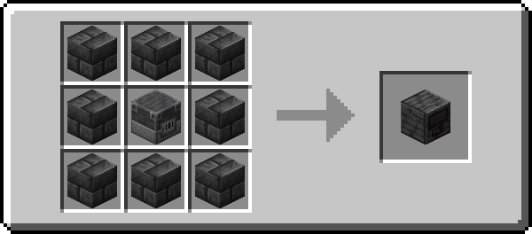
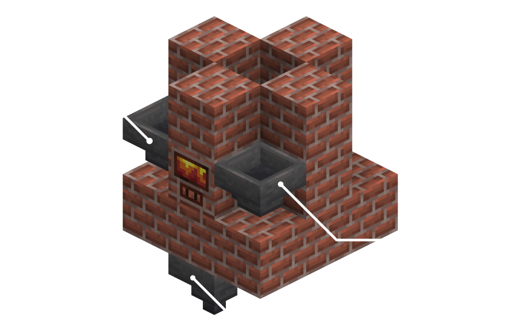
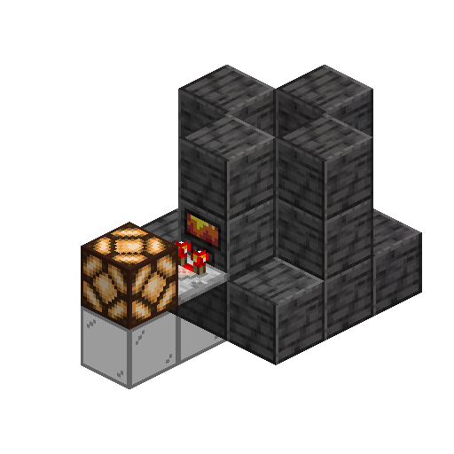

# Building a Forge
*Up to date as of 2.0.22*

You can currently make an Alloy Forge out of 5 materials: Bricks, Stone Bricks, Blackstone, Deepslate, and End Stone.  
Alloy Forges are dynamically generated. You can add more of these through data, which is explained [on this page.](./defining-a-forge.md)

The basic shape of a forge looks like this:  

It has a 3x3 bottom, and is shaped like a chimney. You can put more blocks around it, even covering the top.  
_The glass is there to show the basic shape, it is not part of any default forges._

## Forge Controller  

The Forge controller is crafted from the respective material of the forge tier with a blast furnace in the middle:  

  

### Tiers and Materials
Tiers are important for making recipes harder to make, or to make them more efficient.

Mods and modpacks can add their own Alloy Forges, but by default you can make a Forge out of the following materials: 
- Stone Bricks (Tier 1)
- Bricks (Tier 1)
- Polished Blackstone (Tier 2)
- Deepslate Bricks (Tier 2)
- Prismarine (Tier 2)
- End Stone Bricks (Tier 3)

### Fuels

A forge can by default be fueled by vanilla materials. Currently they accept the following list: 
* Coal and Blocks of Coal
* Charcoal 
* Blaze Rods 
* Lava Bucket

For more information on how to add recipes and fuels, [go to this page.](./recipes.md)  

## Automation  
As of Alloy Forgery 2.0.0 automation has been improved. You can now finally use hoppers to automate alloy forging.
  
**NOTE** *- You can also use a Hopper Minecart instead of a regular hopper. Modded transfer methods might not be supported.*  

---
As of Alloy Forgery 2.0.8 hoppers will automatically stop inserting items when it is forging. In larger contraptions, or older versions of the mod, you might want to use redstone in order to automate them more effectively.  
  
For this you can use a comparator on the Forge Controller. It even supports putting the comparator ***inside*** the Forge.  