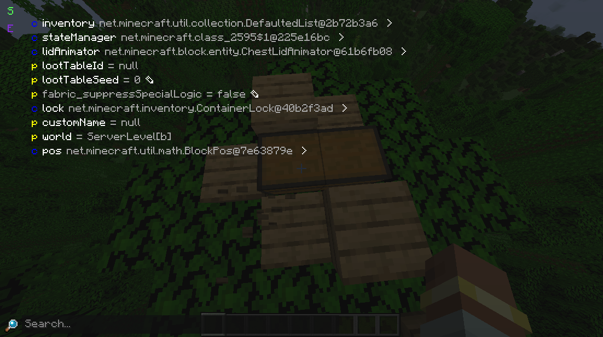
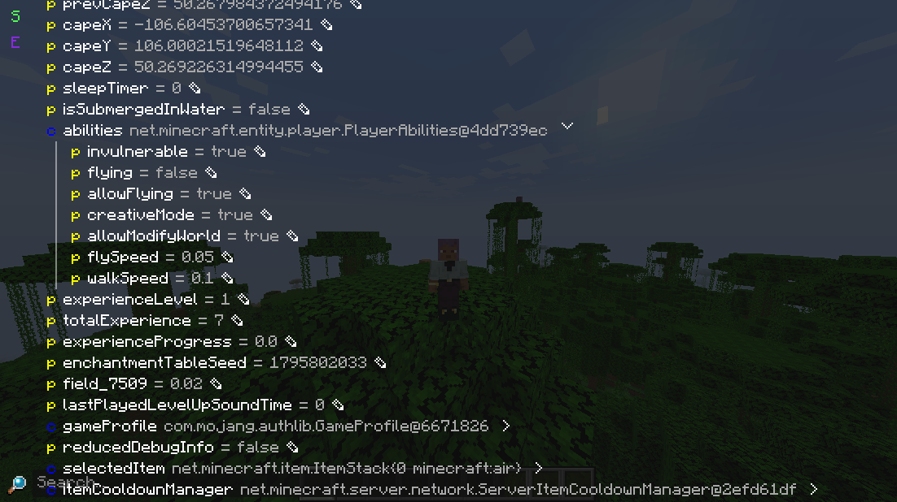
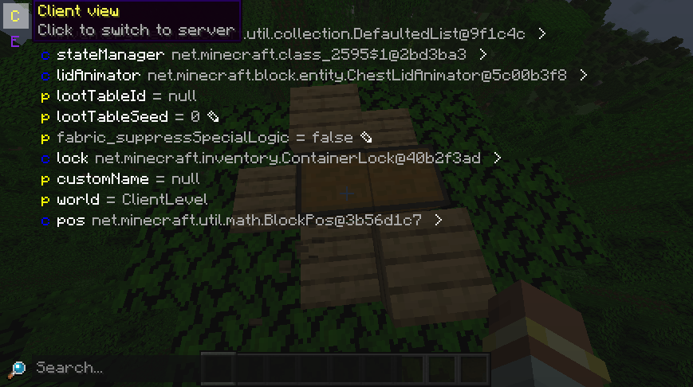
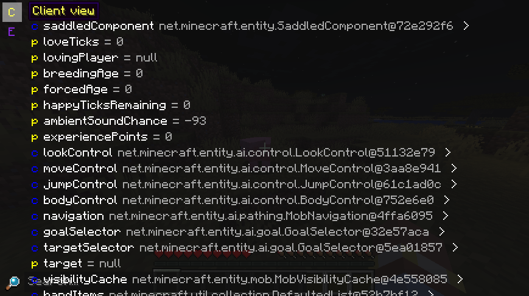
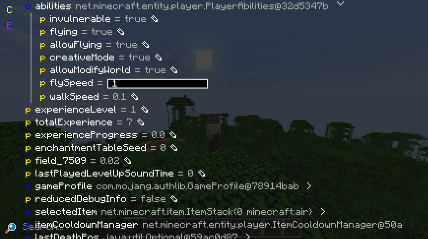

The first (but sadly not most popular) feature of gadget is the entity inspector, with which you can inspect and edit (block)entities' server and client views.
To inspect a (block)entity, press the `Inspect (default: I)` key while targeting it - all entities are included in the raycast, even ones that aren't collidable.

{ .docs-image }

If you want to inspect yourself instead, just press `Inspect` while in any third person mode.

{ .docs-image }

## Sidebar
The `S`/`C` button switches between the client and server views. If the server doesn't have gadget or the player doesn't have enough permissions, then only the client view is usable.

=== "Server view"
    { .docs-image }

=== "Client view"
    { .docs-image }

=== "Client view on unsupported server"
    { .docs-image }

The `E` (export) button can also be used to export the entire field dump as plain text or JSON.

## Editing data
While the entity inspector is mostly used for inspecting data, you can also use it for editing.
Currently, only editing some primitives is supported (e.g. strings, integers, items), though support for more complex editing is planned.

To start editing a field, press the edit symbol next to the value. Pressing enter will finish the edit and apply changes, while escape will discard your edit.
{ .docs-image }

## Internals
The underlying widget of the field inspector (`FieldDataIsland`) is also embeddable into other UIs - it's even used to display packets in the [packet dump viewer](packet-dumps/index.md). This is one of the more complex subsystems of gadget, though, so we will start with the basics.

### Field objects
Every field value in gadget is represented by a `FieldObject`. There are 5 types:

1. `primitive`  
    Describes any value that can be easily turned into a string and displayed with `PrettyPrinters.tryPrint`.
    Includes most basic standard library types, registry entries and `MinecraftServer`.
2. `complex`  
    Used for all objects not described by the other field types.
    Represented as the value's type and its fields.
3. `error`  
    Used if getting or converting the field's value resulted in an error.
4. `nbt`  
    Used for `NbtCompound`s.
    Contains the tag inside it.
5. `bytes`  
    Used for `byte[]`, `ByteBuffer` and `ByteBuf`.
    Shown as a hex dump.

The main class for gathering field data and getting field objects is `FieldObjects`, which has methods for getting class data and turning a value into a field object.

### `FieldDataHolder`
`FieldDataHolder` is the abstract root of all field data managing classes. It supports reading in data asynchronously from a data source, dumping everything to plain text/JSON and using custom logic for field nodes. `FieldDataIsland` is just a subclass which provides owo-ui rendering capabilities. Additionally, the `DefaultFieldDataHolder` is provided if you don't want to extend anything and just want to deal with field data yourself.

Implementing a field data holder yourself is rather niche, but if you need to do it you mainly need to make a custom field node type and a way to make it from field data. Reference `FieldDataIsland` for anything else.

### `FieldDataSource`
Field data holders are agnostic as to what place the field data is coming from. The data can be coming from an object on the same JVM (`LocalFieldDataSource`), or from the server (`RemoteFieldDataSource`, which is used for server entity inspection). Generally, you most likely want to just use the local field data source, but if you need some special processing or RPC, implementing `FieldDataSource` yourself is your best bet.

The contract of the interface makes getting the data of the root node synchronous (as it's immediately needed when making the data holder), so it's advised to send it with the initial packet if you're doing RPC. Furthermore, any RPC implementation should put timeouts on its futures (as otherwise the data holder will just wait indefinitely) and try to pass all errors to the caller.

### Embedding
Embedding a basic field data island is incredibly simple:
```java
FieldDataIsland island = new FieldDataIsland(
    new LocalFieldDataSource(object, false), // (1)
    false, // (2)
    false // (3)
);

out.child(island.mainContainer());
```

1. The second parameter to `LocalFieldDataSource` determines whether the view will allow changing the object.
2. By default, complex field objects are shown as their type's full name. Setting this to `true` disables that.
3. If you want to implement search for your data, enabling this will generate `SearchAnchorComponent` for every relevant field.