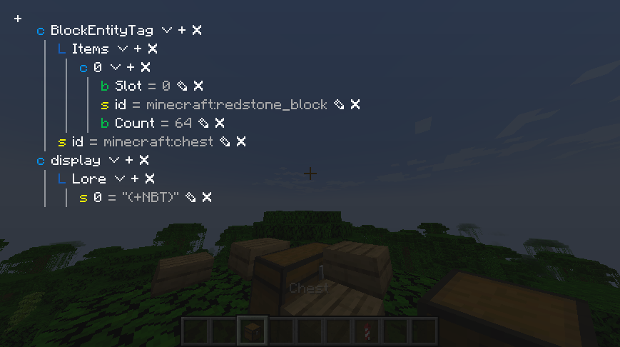
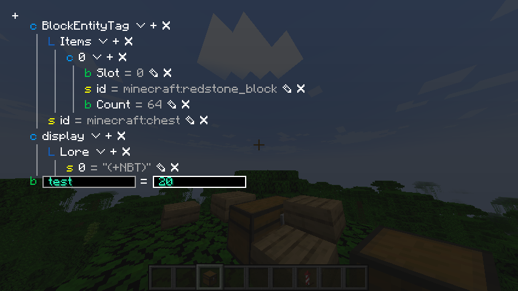
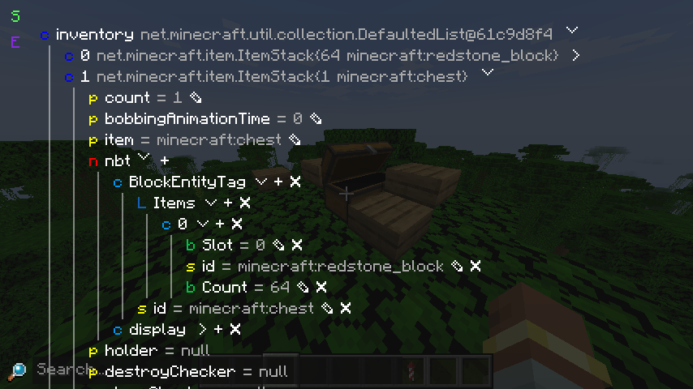

While direct field editing is adequate for entities and block entities, items only have NBT data, so the NBT inspector exists mainly to edit attached data to item stacks.

To inspect a stack, press the `Inspect (default: I)` key while you're hovering over it in a handled screen.
As usual, the arrow button hides/shows the tree element.
{ .docs-image }

## Editing
If you [have permission to change item stacks](./for_server_admins.md), then the NBT inspector allows you to do a bunch of basic NBT modification. The edit button allows you to edit the value of the associated row, and the remove button just removes the entire entry from the tag.

To add something to a tag, press the add button next to the entry (or the add button in the sidebar if it's the root tag).
If the type of entry is not already predetermined (e.g. you're in a compound), then you will be shown the type picker. After the type is chosen, then it's just a matter of picking the name (or index if it's a list) of the new element and the inital value. Pressing enter finalizes the added tag.
{ .docs-image }
{ .docs-image }

## Embedding
While the NBT inspector is directly used for inspecting item stacks in gadget, it's also made to be embedded into other UIs or trees.
In fact, the field inspector uses it to represent NBT values:
{ .docs-image }

The main widget here is `NbtDataIsland`, as it is responsible for displaying and updating the NBT tag.
The constructor takes in the original NBT tag and a `#!java Consumer<NbtCompound> reloader` that is used whenever the tag is changed by the user.
To use it, just instantiate it and add it to your owo-ui flow layout:
```java
var island = new NbtDataIsland(tag, reloader); // (1)

view.child(island);

if (source.isMutable()) { // (2)
    var plusLabel = Components.label(Text.of("+"));

    GuiUtil.semiButton(plusLabel, (mouseX, mouseY) ->
        island.typeSelector(
            (int) (plusLabel.x() + mouseX),
            (int) (plusLabel.y() + mouseY),
            type -> subContainer.child(new KeyAdderWidget(island, NbtPath.EMPTY, type, unused -> true)))
    );

    header.child(plusLabel);
}
```

1. If you want the tag to be immutable, just pass in `#!java null` as the reloader.
2. Right now, making a root add button for the island is kind of clunky, as it generally expects you to manage the whole process yourself.
   This will most likely change in the future.