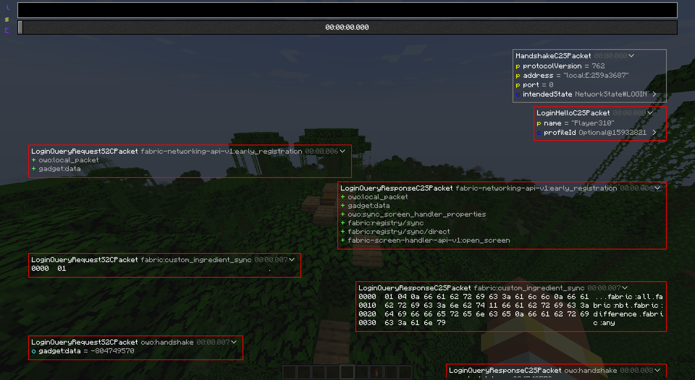

gadget supports dumping all messages sent from and received by the client and viewing them via an in-game viewer. 

This can greatly help with debugging all sorts of networking issues (barring TCP issues, of course) and makes it easier to see what was going on in a user's modpack without having to reproduce what was going on.