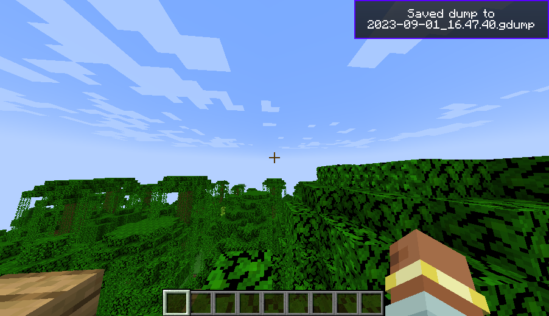
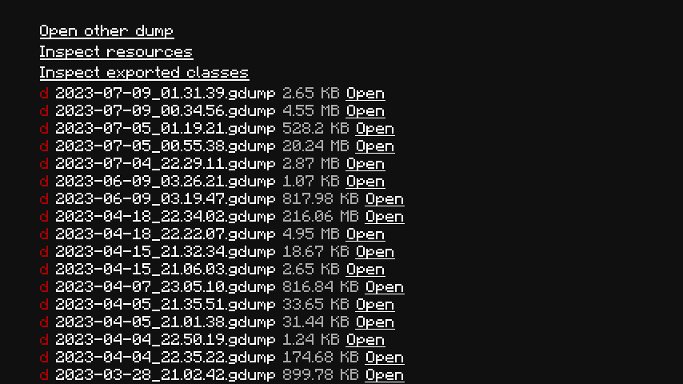
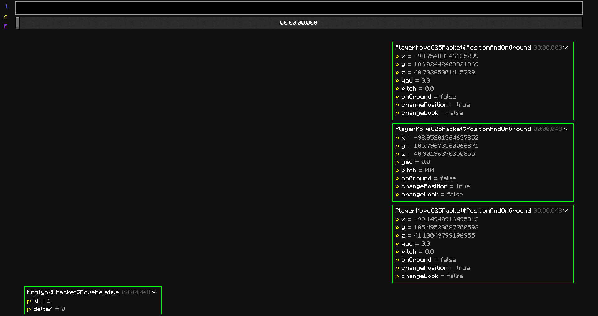
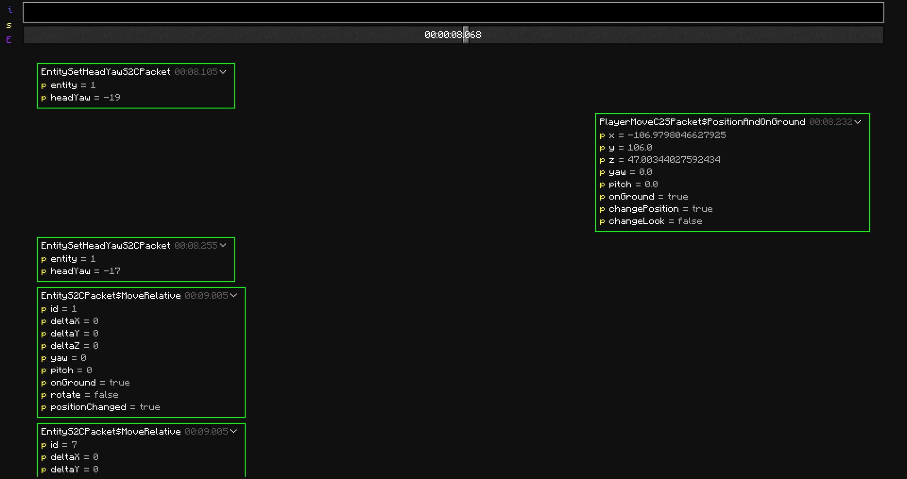
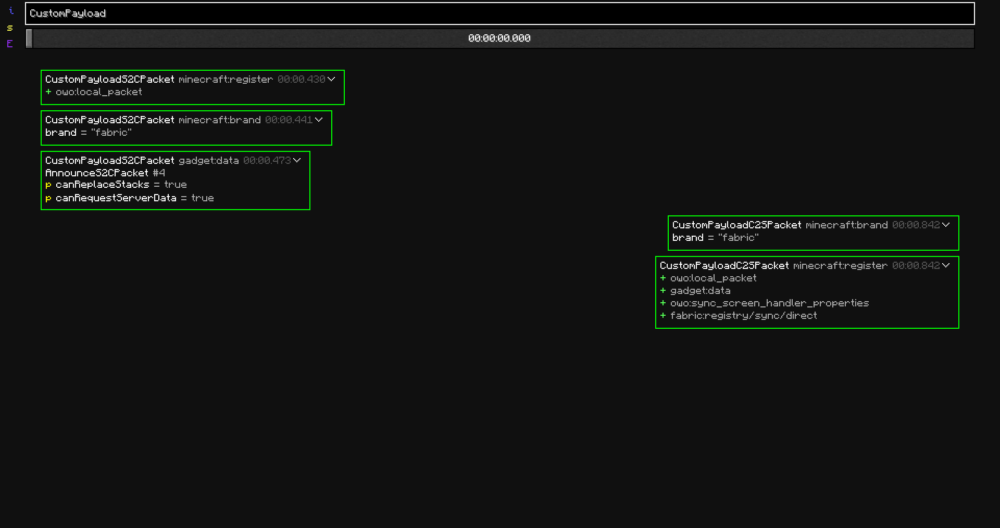

## Recording a packet dump

If you are already in game, then just pressing the `Dump Packets (default: K)` key will start dumping all traffic from that point. 
You can also just right click the specific entry in the Singleplayer/Multiplayer screen and then press `Join and start dumping packets` to join with the packet dumper enabled.

{ .docs-image }

If you want to stop and save the dump, you can just press the `Dump Packets` key again or leave the world - the toast will show the saved dump's file name. If you want to then manually inspect the dump file, it should be under `.minecraft/gadget/dumps`.

{ .docs-image }

## Opening a packet dump

A list of all dumps is in the gadget menu, which is accessible via the `G` button on the title/menu screen.

{ .docs-image }

To open a packet dump, press the convenient <u>`Open`</u> button next to the file name to open the viewer. If you have a dump stored somewhere else, you can open a file picker with the <u>`Open other dump`</u> button.

## Viewing a packet dump

!!! warning
    The UI doesn't work well on high GUI scales or low window sizes. GUI Scale 2 is recommended.

{ .docs-image }

The dump viewer is conceptually a list of all packets in the dump together with some filters to not show everything at once. Most vanilla and supported modded packets are represented as the values of their fields, with unsupported packets just shown as a hex dump of their contents.

By default, the first 300 packets of the dump are shown. If you want to see later packets, the slider controls the point in time from which packets are shown. (Admittedly, this is a pretty short packet)
{ .docs-image }

If you want to filter by packet type, you can also use the search box, which searches by packet class and identifier.
{ .docs-image }