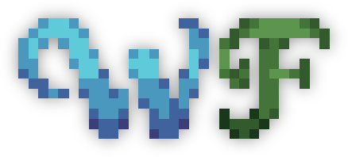

# Welcome to the Wisp Forest Documentation Hub

{ .center-image .sized-image style="--image-width: 65%; margin-top: -3em;" }

### :material-account: For Users
- If you're a user, you're probably looking for the [FAQ](faq) which should answer most of the common questions and problems you might encounter.
- You can also find the guidebooks of our mods hosted, over on the [guides subdomain](https://guides.wispforest.io)
- The documentation for [Isometric Renders](isometric-renders/home.md) is also available here, with every aspect of the mod covered in great detail.

### :material-code-json: For Developers
- The documentation for oωo can be found [here](owo/setup)
- The documentation for scatter is located [here](scatter/home.md)
- You can also find a [list of all Fabric API events](fabric-events.md) on this site

***

### :simple-github: Sources 

The entirety of this site is available [on GitHub](https://github.com/wisp-forest/docs), where you can submit additions and corrections or report issues you found