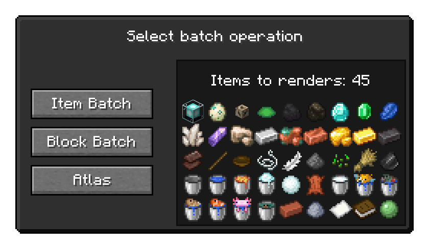

<!-- !!! tip ""
    **:octicons-clock-16: The Isometric Renders documentation is currently being rewritten - it is not accurate for versions >=0.3.0**

  -->

# Isometric Renders
To get started, check out [/isorender](slash_isorender.md) - that page contains documentation for the primary command you use to launch Isometric Renders

!!! abstract ""
    #### Performance Warning
    By nature, working with large images can be a very intense task for your processor to deal with. Starting at roughly 6000x6000, you may notice considerable slowdown when creating renders - especially when doing multiple at the same time. For this reason, be carefully when starting a long batch render or exporting an animation at high resolution - your system might not like it.

    #### Unsafe Mode
    For the very reasons outlined above, the export resolution is usually capped at 16384x16384. If you're confident your hardware can take it, you can enable **Unsafe Mode** with the `/isorender unsafe` subcommand

### Convenience Features
 - #### Inventory-based batches

    You might want to perform batch operations like rendering an atlas or a block/item batch on sets of items that don't necessarily form a creative tab, tag or namespace. To do this, you can simply press ++ctrl+f12++ while in any inventory. You will get a preview of which items will be rendered and can choose which batch operation to start.

    { .center-image .sized-image style="--image-width: 90%;" }

 - #### Visual area selection

    Usually when creating an area render you do not want to manually figure out the coordinates of the area's corners. Instead, you would use the keybind labelled **[ISO] Select Area**. Pressing it once highlights and selects the first corner of your selection, pressing it again selects the second corner. You can then run `/isorender area` without any further arguments to render the area in this selection.

    To clear your area selection and make the overlay disappear, press the keybind while sneaking.

 - #### Studio Mode

    While in a render screen, you can press ++f10++ to ender **Studio Mode**. While in this mode, the background of your screen is filled with your [background color](options.md#background-color) and the UI is not rendered. This is sometimes useful when you want to take a screen recording and don't care about transparency or a higher resolution than your monitor support. To exit Studio Mode, press ++f10++ again.
