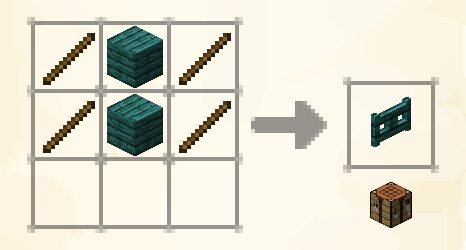

**:material-progress-alert: Work-in-progress**

Lavender offers a wide range of text-formatting syntax, most of which is just standard markdown, for adding emphasis and structure as well as entirely custom elements to your guidebook entries. This system is based on [lavender-md](https://github.com/wisp-forest/lavender-md), a highly flexible & extensible markdown processing engine, which also allows you to easily add custom syntax.

This article outlines the standard syntactical constructs supported by Lavender, from standard Markdown all the way to custom oωo-ui templates


## Text Formatting

### Emphasis

Like in all standard Markdown renderers, you use 

- `*single asterisks*` for *italic text*
- `**double asterisks**` for **bold text**
- `***triple asterisks***` for ***bold and italic text*** 

Lavender intentionally does not support any of the alternative characters usually implemented by other renderers in an effort to encourage consistency

Furthermore, like in Discord for example, you can use

- `__double underscores__` for <u>underlined text</u>
- `~~double tilde~~` for ~~strike-through text~~

### Color

To add color to a span of text, you open with `{<color here>}` and close with `{}`. The `<color here>` part can be one of two things: either one of Minecrat's text colors (like `red`) or a 6 digit `#RRGGBB` hex color. Refer to the following examples:

- `{red}some red{} text`<br>
  <span style="color: #FF5555;">some red</span> text
- `{#F1C27B}a hex color with {light_purple}interspersed purple{} and{} back`<br>
  <span style="color: #F1C27B;">a hex color with <span style="color: #FF55FF;">interspersed purple</span> and</span> back

### Links

Using standard Markdown syntax, wrap some text into `[square brackets](followed by a link in parantheses)` to create a [hyperlink](https://youtu.be/dQw4w9WgXcQ). 

However, Lavender also offers specific syntax for linking to other entries or categories in the same book. To create an internal link, begin it with a caret `^` and follow with the ID of an entry or category (derived using the resource's namespace and path relative to their respective directory). Refer to these handy examples:

- `[category link](^mymod:a_category)`<br>
  Links to `assets/mymod/lavender/categories/<book id>/a_category.md`
- `[entry link](^mymod:basics/an_entry)`<br>
  Links to `assets/mymod/lavender/entries/<book id>/basics/an_entry.md`

## Text Structuring

### Block Quotes

Once again referring to standard Markdown, you prefix some lines of text with `>` to turn them into a quote. You can also repeat this symbol to increase the quote nesting depth. Refer to the following examples:

=== "Input"
    ```md
    > block quote here
    >
    > very profound
    ```

=== "Rendered"
    > block quote here
    >
    > very profound

<span><!--separator--></span>

=== "Input"
    ```md
    > quote level 1
    >> now onto level 2
    > and back onto 1
    ```

=== "Rendered"
    > quote level 1
    >> now onto level 2
    >
    > and back onto 1

### Horizontal Rules

Continuing this trend, you can also insert a horizontal rule like this one

---

using `---` triple dashes. Unlike most other renderers, Lavender once again specifically does not support any alternative characters for this to encourage consistency

### Lists

Lavender supports both ordered & unordered lists which can contain any other Markdown. Like with other syntax elements that allow multple kinds of characters, you are required to use `-` dashes for unordered lists - like so:

=== "Input"
    ```md
    - an element
    - another one
        - and a nested one
            - deeper
    - and back to base
    ```

=== "Rendered"
    - an element
    - another one
        - and a nested one
            - deeper
    - and back to base

To instead create an ordered list, simply replace the dashes with the item's index - like so:

=== "Input"
    ```md
    1. an element
    2. another one
        3. and a nested one
            4. deeper
    7. and back to base
    ```

=== "Rendered"
    1. an element
    2. another one
        3. and a nested one
            4. deeper
    7. and back to base

    !!! note ""
        Do note that, unlike in this demonstration using MkDocs' markdown renderer, Lavender does not renumber your elements and instead uses the index you provide verbatim

### Page Breaks

In order to prevent inconsistent results and confusing rules, Lavender makes no attempts to automatically break your entries into pages. Instead, you need to manually insert a page break, like this:

```md
...page 1 content here...

;;;;;

...page 2 content here...
```

Notice the two blank lines above and below the page break - they are part of this syntax and must not be omitted

## Game Elements

### Keybinds

To insert a dynamically updating reference to a keybinding, use `<keybind;"translation key of binding here">` - like this:

`<keybind;key.attack>` renders as
{ .docs-image }

To get the translation key of a given keybind, look it up in game's `options.txt` file. You'll notice that it saves the keybindings using a `key_` prefix - you need to drop this. The key in our example here is stored as `key_key.attack` in the file, yet we only use `key.attack`

### Entities, Items, Blocks and Recipes

To insert a preview of the mentioned game elements, you use the same syntax as for keybindings - like in these examples:

- `<entity;minecraft:zombie>`<br>
  Insert a Zombie

- `<entity;minecraft:zombie{IsBaby:1b}>`<br>
  Insert a Baby Zombie by providing the relevant NBT tag in addition to the entity ID

- `<item;minecraft:diamond_shovel>`<br>
  Inserts a Diamond Shovel, with a proper functioning tooltip as well

- `<item;minecraft:diamond_shovel{Enchantments:[{id: "minecraft:efficiency", lvl: 5}]}>`<br>
  Inserts a Diamond Shovel enchanted with Efficiency V by providing the relevant NBT tag in addition to the item ID

- `<block;minecraft:furnace>`<br>
  Insert a Furnace

- `<block;minecraft:furnace[lit=true]>`<br>
  Inserts a lit Furnace by providing the relevant block state properties. NBT for block entities is supported as well (you can use the `/setblock` command as reference for the syntax)

### Recipes

To insert a dynamically updating recipe preview, use the familiar syntax for `recipe` and supply the recipe's ID - like this: `<recipe;minecraft:warped_fence_gate>`

{ .docs-image .center-image }

Do note that this preview is entirely dynamic, and if the recipe gets changed or replaced (even by one of an entirely separate type) it will still be accurate. By default, all Vanilla recipe types are supported - if you are a mod author you can add your own ones using Lavender's simple API. Specifically, take a look at `BookScreen.registerRecipeHandler`.

### Textures (Images)

Images in lavender-md are a bit of a special case, as they actually display textures and not arbitrary images loaded from the internet. The basic syntax is identical to standard markdown: ``. 

For example, to display the Fire Resistance icon, use the following: ``

As you'll notice, by default the texture is display with its actual size - however, this is not usually desireable when you need to display an image on your page. To make Lavender stretch the texture to the width of the page, append `,fit` after the resource ID.

As another example, to display the Furnace's GUI texture scaled to fit the page, use: ``

#### Adding your own textures

For the presumably most common use-case, displaying your own images, you need to include said image as a texture resource in your mod's resource pack (that is, somewhere in `assets/mymod/textures`). Ideally, you make them 256x256 in size - we love our good ol' powers of two.

## oωo-ui Templates

The most flexible way of creating custom components for you pages (without writing code, that is), is by using oωo-ui templates. You can read some more on how to create UI-models [here](../owo/ui/getting-started.md#data-driven). 

Once you have a UI model with your template in it, you can use the following syntax to insert it into Lavender markdown:

`<|template-name@ui-model-id|>`<br>
or, if your template takes parameters<br>
`<|template-name@ui-model-id|param1=value1,param2=value2|>`

If any of your template parameters contain a comma, you can escape it using `\`