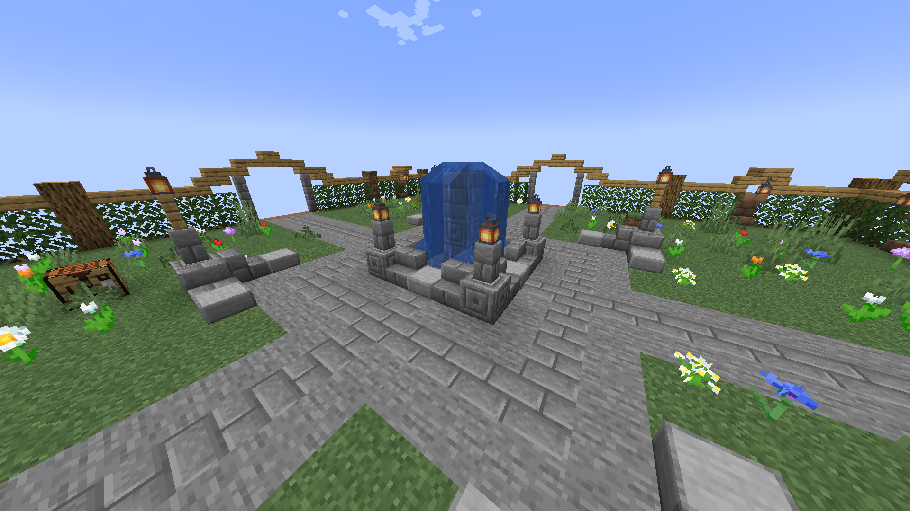
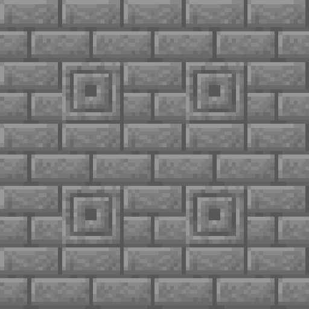
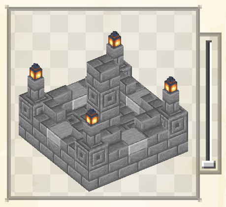
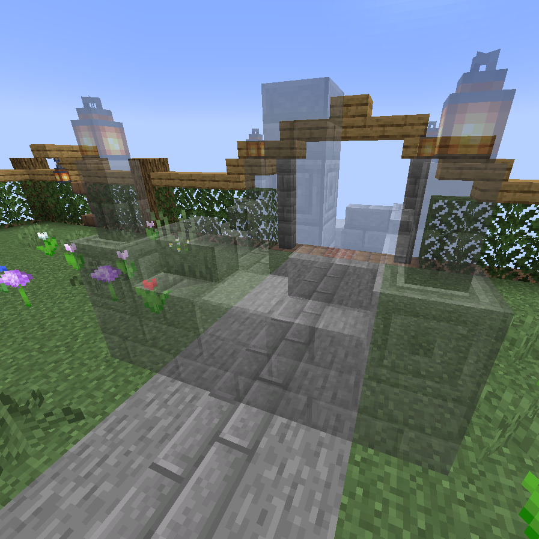
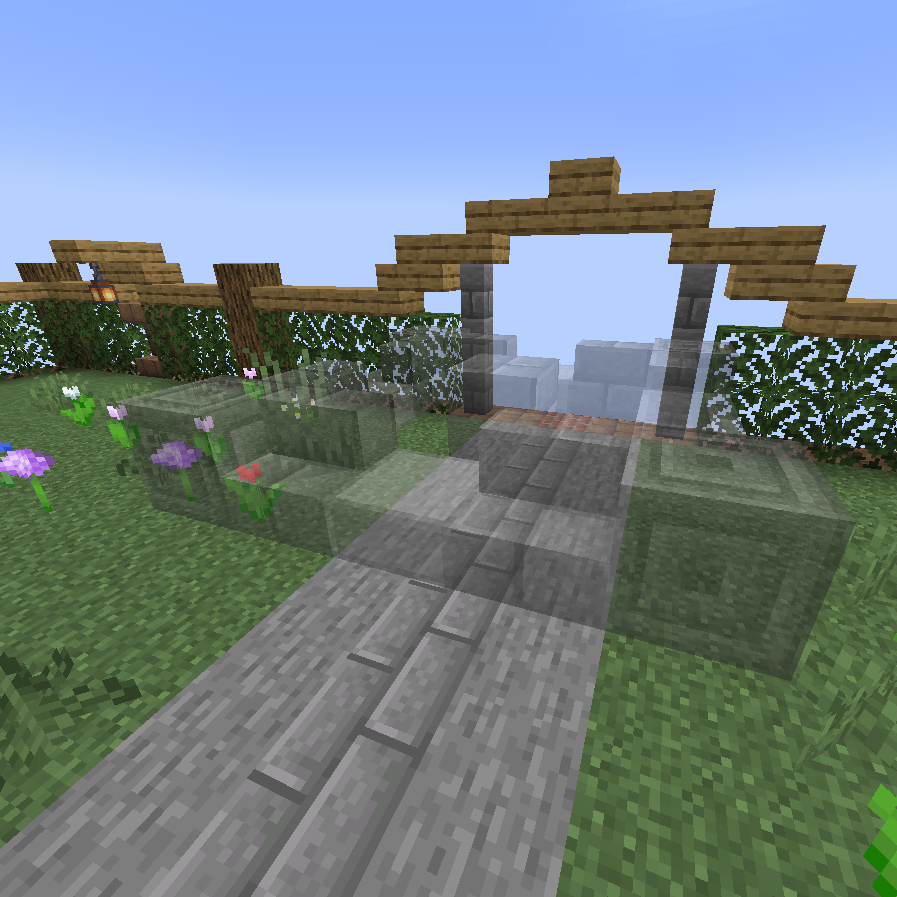

Many mods involve multiblock structures of some kind, which can be hard if not nigh impossible to describe using text alone. It is almost always preferable to simply give the player a direct preview of what the structure looks like when fully built.

For this purpose, Lavender (much like Patchouli) offers structure preview & verification. The player can preview your structures in your book *and* right in the world - layer by layer if necessary.

## Creating a structure definition

In this tutorial, we'll be creating the structure definition for the well you see in this screenshot:
{ .docs-image }

To get started, create a JSON file in `assets/mymod/lavender/structures` - we'll call it `well.json`, for obvious reasons. Then, create the two base elements of a structure's definition. If you've worked with the JSON representation of shaped recipes before, this might look familiar:

- `keys`, object<br>
  The keys object is a mapping from single-character keys to the block(s) they represent. The value associated with each key must be a stringified block state - the kind of input the `/setblock` command expects. 
- `layers`, array of arrays<br>
  Each inner array of the `layers` array describes a single layer of your structure, from the bottom up. Each layer in turn contains a string, where each character represents a block through the mappings defined in `keys`

Let's start by adding all of the keys required for the well:
```json title="well.json"
{
  "keys": {
    "c": "minecraft:chiseled_stone_bricks",
    "s": "minecraft:stone_brick_stairs[facing=north]",
    "u": "minecraft:stone_brick_stairs[facing=south]",
    "e": "minecraft:stone_brick_stairs[facing=east]",
    "t": "minecraft:stone_brick_stairs[facing=west]",
    "l": "minecraft:smooth_stone_slab",
    "b": "minecraft:stone_bricks",
    "w": "minecraft:stone_brick_wall",
    "a": "minecraft:lantern"
  },
  "layers": []
}
```

You'll notice that we added the Stone Brick Stairs four times, each with a different facing - this also nicely demonstrates how to use block state properties. 

Now, let's get to defining the first layer of our structure. Let's take a look at just the first layer:

{ width=300 .center-image }

To turn it into a layer, we simply go row-by-row, adding a new string to the layer's array for each. Remembering that the key for Stone Bricks is `b` and Chiseled Stone Bricks are `c`, we end up with this layer definition:

```json title="well.json"
{
  "keys": { ... },
  "layers": [
    [
      "bbbbb",
      "bcbcb",
      "bbbbb",
      "bcbcb",
      "bbbbb"
    ]
  ]
}
```

Comparing this with the above snapshot of the layer in-game, the 1:1 correspondence between block layout and layer definition should be abundantly clear. We continue with the other layers in the same fashion, leaving us with a final structure definition that looks like this:

```json
{
  "keys": {
    "c": "minecraft:chiseled_stone_bricks",
    "s": "minecraft:stone_brick_stairs[facing=north]",
    "u": "minecraft:stone_brick_stairs[facing=south]",
    "e": "minecraft:stone_brick_stairs[facing=east]",
    "t": "minecraft:stone_brick_stairs[facing=west]",
    "l": "minecraft:smooth_stone_slab",
    "b": "minecraft:stone_bricks",
    "w": "minecraft:stone_brick_wall",
    "a": "minecraft:lantern"
  },
  "layers": [
    [
      "bbbbb",
      "bcbcb",
      "bbbbb",
      "bcbcb",
      "bbbbb"
    ],
    [
      "culuc",
      "e   t",
      "l b l",
      "e   t",
      "cslsc"
    ],
    [
      "w   w",
      "     ",
      "  c  ",
      "     ",
      "w   w"
    ],
    [
      "a   a",
      "     ",
      "  b  ",
      "     ",
      "a   a"
    ]
  ]
}
```

You'll notice that where there's air (or, well, nothing) in our structure we put a space (` `) - Lavender automatically interprets this to mean "anything goes" (including other blocks!). If you specifically want a space to be empty, use an underscore (`_`) instead.

## Adding the structure to an entry

Just like the other game elements described in [Markdown Syntax](markdown-syntax.md#game-elements), a structure is inserted into an entry (or, if you need this for some reason, category) using the `<structure;"structure ID here">` syntax. Thus, to insert the structure we just defined, we use `<structure;mymod:well>`

{ .docs-image .center-image }

## Previewing in-game

Once you have the structure successfully showing up in a book, simply clicking it suffices to place it into the game world. While the preview is following your view, you can scroll to rotate and then right-click to anchor it.

When the preview is placed, the progress-bar in the bottom left of your screen indicates progress towards completing the structure - it also turns red there is invalid block. Said blocks also get marked with a pulsating mining overlay to clearly indicate this information to the player.

<center>
    { width=300 .round-image style="margin-right: 1.5em;" }
    { width=300 .round-image }
</center>

When your structure has multiple layers, like the well does, you can use the slider that appears next to the preview in the book to change which layer is displayed.