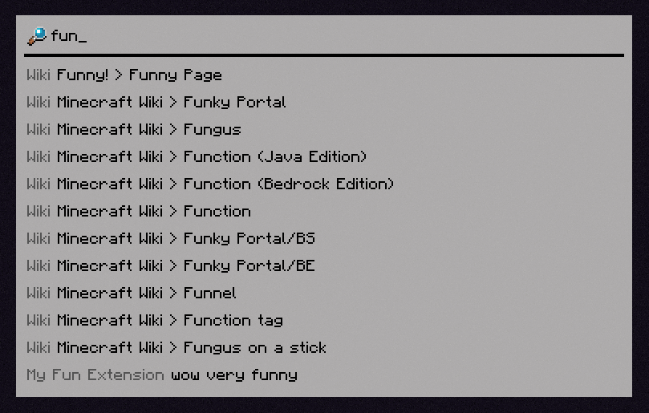

The built-in **Wiki** (`limelight:wiki`) extension has support for custom wikis, defined via resource
packs. Limelight addons can register custom wiki sources to add support for non-default types of wikis.

Let's add a wiki source for a hypothetical wiki that has an API like this:
```
GET https://wiki.example.com/api/search?query=funny

HTTP 200
[
    ["Funny Page", "https://wiki.example.com/funny"]
]
```

```java
public record FunnyWikiSource(String apiUrl) implements WikiSource {
    // (1)
    public static final Endec<FunnyWikiSource> ENDEC = StructEndecBuilder.of(
        Endec.STRING.fieldOf("api_url", FunnyWikiSource::apiUrl),
        FunnyWikiSource::new
    );

    public static final WikiSourceType<FunnyWikiSource> TYPE = new WikiSourceType<>(ENDEC);

    public static void init() {
        Registry.register(WikiSourceType.REGISTRY, Identifier.of("example-extension", "funny"), TYPE);
    }

    @Override
    public String createSearchUrl(String searchText) {
        // (2)
        return apiUrl + "/search?query=" + URLEncoder.encode(searchText, StandardCharsets.UTF_8);
    }

    @Override
    public void gatherEntriesFromSearch(String queryBody, String searchText, Consumer<EntryData> entryConsumer) {
        JsonArray json = JsonParser.parseString(queryBody).getAsJsonArray();

        for (var resultEl : json) {
            JsonArray result = resultEl.getAsJsonArray();

            entryConsumer.accept(new EntryData(result.get(0).getAsString(), result.get(1).getAsString()));
        }
    }

    @Override
    public WikiSourceType<?> type() {
        return TYPE;
    }
}
```

1. This is an [Endec](../../owo/endec.md), oωo's serialization system.  
If you prefer Codecs, you can use them too:
```java
public static final Codec<FunnyWikiSource> CODEC = RecordCodecBuilder.create(i -> i.group(
        Codec.STRING.fieldOf("api_url").forGetter(FunnyWikiSource::apiUrl)
    ).apply(i, FunnyWikiSource::new)
);
public static final WikiSourceType<FunnyWikiSource> TYPE = new WikiSourceType<>(CODEC);
```

2. This method returns a URL that needs to be queried to find entries for this search text. If your wiki
has a central search index, you can just always return that, since the retrieved contents will be cached.

After this source type is registered, you need to add your wiki[^1]:
```json title="assets/example-extension/limelight/wiki/funny.json"
{
    "type": "example-extension:funny",
    "title": "Funny!",
    "bang_key": "funnywiki",
    "source": {
        "api_url": "https://wiki.example.com/api"
    },
    "language_overrides": {
        "en_pt": {
            "api_url": "https://piratewiki.example.com/api"
        }
    }
}
```

This results in this output:
{ .docs-image }
{ .docs-image }

[^1]: The wiki format is described in the [Adding Wikis](../configuring/adding_wikis.md) page