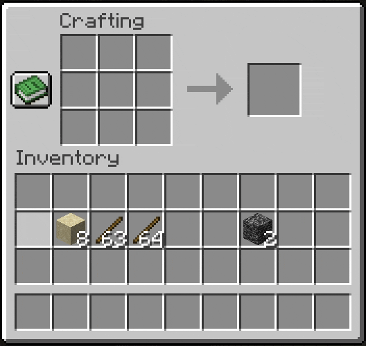

Minecraft has a remainder system for items, although it is restricted to a single remainder per item for all recipes. This system is designed to be more flexible.

Let's start with normal recipe you might make within your mod:

```json title="test_recipe.json"
{
  "type": "minecraft:crafting_shaped",
  "key": {
    "#": {
      "item": "minecraft:stick"
    },
    "X": {
      "item": "minecraft:sand"
    }
  },
  "pattern": [
    "XXX",
    "X#X",
    "XXX"
  ],
  "result": {
    "item": "minecraft:bedrock"
  }
}
```

Then declare the identifier of given target item and then declare the remainder item. Either use the item's identifier or create a JSON object with the following Parameters:

| Parameter | Description |
| --- | --- |
| `item` | The Identifier of the given item being returned |
| `count` | The amount of the given item to be returned |

???+ important
	Currently custom NBT data is not supported!

```json title="test_recipe.json"
{
  ...
  "owo:remainders": {
    "minecraft:sand": "minecraft:sand",
    "minecraft:stick": {
      "item": "minecraft:stick",
      "count": 64
    }
  }
  ...
}
```

The given recipe will now return our declared Remainders when crafted:

{ .docs-image .center-image }