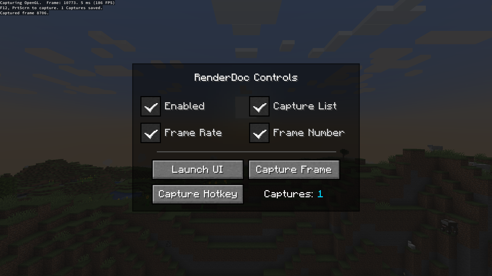

**:octicons-alert-16: Experimental feature**

oωo includes a comprehensive wrapper for the [RenderDoc](https://renderdoc.org) API. RenderDoc is an open-source graphics debugger that helps you understand and trace bugs in rendering code. To set it up for use with oωo's API wrapper, follow the instructions for your OS:

=== "Linux"
    In order to load the RenderDoc dynamic library you need to run your game with the `LD_PRELOAD` environment variable pointing to your copy of `librenderdoc.so`. 
    
    If you installed RenderDoc from a package manager this is usually located in `/usr/lib/`, if you simply extracted the official archive it'll be in the `lib` subdirectory. Once you have the full path to the library, assign it to the environment variable. 
    
    If you're using IntelliJ, you can do this by editing your run configuration and adding something like `LD_PRELOAD=/home/user/renderdoc/lib/librenderdoc.so` to the "Environment Variables" field.

=== "Windows"
    To load the RenderDoc dynamic library on Windows you first need to locate renderdoc.dll. In the official ZIP distribution you can find it directly in the root of the archive. Once you have the full path to the library, assign it to the `-Dowo.renderdocPath` Java system property. 
    
    In IntelliJ, you can do this by editing your run configuration and adding something like `-Dowo.renderdocPath="C:\Users\user\renderdoc\renderdoc.dll"` to the "VM Options" field (the second one from the top).

### In-game UI

If RenderDoc is detected while running in debug mode, owo's `/renderdoc` command will be made available. This command opens a screen that you can use to configure the RenderDoc overlay as well as to trigger captures and, most importantly, open the RenderDoc replay UI. This is especially useful as it means you can always have RenderDoc injected while developing and do a capture and analyze it on-demand.

{ .docs-image }

### owo-ui integration

When running in debug mode with RenderDoc injected, owo-ui screens expose an additional hotkey you may use to create a capture of only the UI. This is quite convenient as it means the capture is significantly less bulky and only includes the draw calls you care about when debugging your screen.

To create a capture, press ++ctrl+alt+r++

### Global API

oωo exposes the global `RenderDoc` API class that wraps all relevant RenderDoc API interfaces in a type-safe manner. You can use it to configure the overlay, set up the hotkeys for capturing and change RenderDoc's capture configuration.

Some methods of particular interest include: 

 - `#!java startFrameCapture()` and `#!java endFrameCapture()`, which you can use to capture only the draw calls between these method invocations

 - `#!java getCapture(int index)` which you can use to obtain information about a past capture

 - `#!java launchReplayUI(boolean connect)` and `#!java showReplayUI()` which open a new replay UI window or bring an existing one to the front

and most importantly `#!java isAvailable()`, which reports whether the RenderDoc dynamic library is loaded and oωo could successfully connect to the API