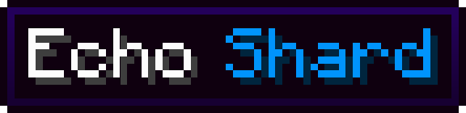
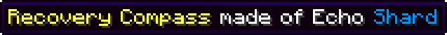
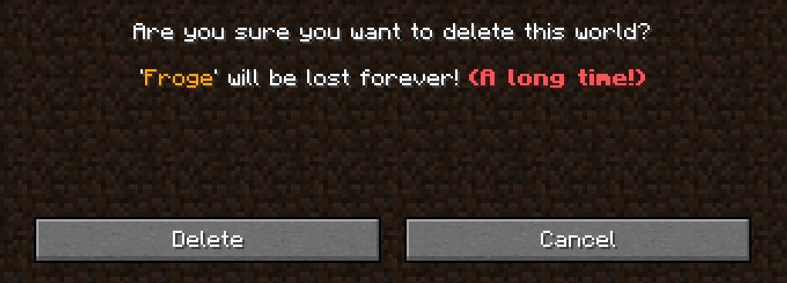

When owo is installed, a number of modifications are made to the translation engine which enable the use of **Text Components** inside translation files. In order to declare a rich translation, use an array instead of string, like so:

```json title="en_us.json"
{
    ...
    "some.translation.key": [...],
    ...
}
```

You can now populate this array with JSON conforming to Minecraft's text component format, which you can look up [on the wiki](https://minecraft.wiki/w/Raw_JSON_text_format). 

### Basic Example
For demonstrating the basics, let's change the name of the Echo Shard. We want the word "Shard" to be <span style="color: #0096FF;">of this blue color</span>, which is achieved by the following simple JSON:

```json title="en_us.json"
{
    ...
    "item.minecraft.echo_shard": [
        "Echo ", // (1)
        { "text": "Shard", "color": "#0096FF" } // (2)
    ],
    ...
}
```

1. You can use plain strings if you don't require any special formatting on a bit of text
2. You can use any color you want, text components support parsing of hex colors in RRGGBB format

This yields the following result:

{ width=300 }

Let's continue by also altering the Recovery Compass to say that it's made of Echo Shards. To do this, we do a normal translation and refer to the echo shard's translation via the `translate` object.

```json title="en_us.json"
{
    ...
    "item.minecraft.echo_shard": [
        "Echo ",
        { "text": "Shard", "color": "#0096FF" }
    ],
    "item.minecraft.recovery_compass": [
        "", // (1)
        { "text": "Recovery Compass", "color": "yellow" }, // (2)
        " made of ",
        { "translate": "item.minecraft.echo_shard" }
    ]
    ...
}
```

1. The style of the first bit of text is applied to all later ones. Since we don't want the entire name to become yellow, we simply specify an empty, unformatted first element.

2. You can also refer directly to the name of any of Minecraft's 16 text colors directly instead of using hex codes

This produces this nice tooltip, with the Echo Shard's name conveniently embedded



### Translatable Text Parameters
As you probably know, a translatable text can have parameters - defined in standard translations via format specifiers like `%s`. This is not available to us when writing a rich translation, thus we must use owo's equivalent - the replacing text content, specified by an `index` object in the JSON. To demonstrate this, let's spice up the warning that get when deleting a world - it contains a parameter for the name of the world to delete.

```json title="en_us.json"
{
    ...
    "selectWorld.deleteWarning": [
        "'",
        { "index": 0, "color": "gold" }, // (1)
        "' will be lost forever! ",
        { "text": "(A long time!)", "color": "red", "bold": true}
    ]
    ...
}
```

1. Here we employ the `index` object. The number you specify is the index of the parameter passed into the translatable text constructor. It accepts style options like any other text component, as demonstrated by the gold color.

The final result looks like this:
{ .docs-image }
