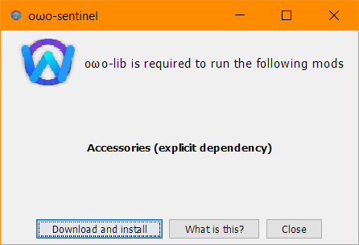
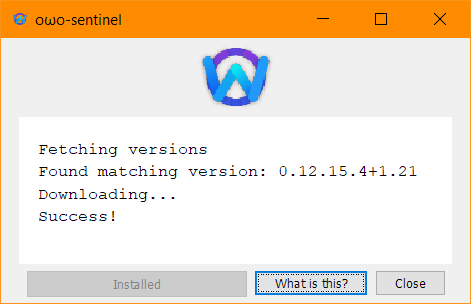
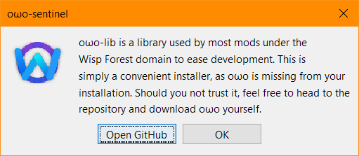

<script>
    window.addEventListener('version-available', event => {
        const code = document.querySelector(".owo-version-container").firstChild;
        code.innerHTML = code.innerHTML.replaceAll("...", event.detail);
    })
</script>

To add oωo to you project, begin by including our maven in the repositories block of your `build.gradle`

```groovy title="build.gradle"
repositories {
    maven { url 'https://maven.wispforest.io/releases/' }
}
```

Then, declare the dependency inside your `dependencies` block and as well as the version you want to use inside your `gradle.properties`. 

=== "build.gradle (Fabric)"
    ```groovy 
    dependencies {
        modImplementation "io.wispforest:owo-lib:${project.owo_version}"
        // Optional Utility Module, More info below
        // You still need to depend on owolib within your Fabric Mod Json (FMJ) as documented in Fabric Wiki [here](https://wiki.fabricmc.net/documentation:fabric_mod_json)
        // and declaring your dependency on owolib on sites your upload your mod i.e. Modrinth or Curseforge
        include "io.wispforest:owo-sentinel:${project.owo_version}"
    }
    ```

    !!! hint "owo-sentinel Explanation"
        owo-sentinel is a super tiny mod which is designed to be Jar-in-Jar'd by mods that depend on owo. If a player then installs your mod **without** installing owo, sentinel will prevent their game from launching and instead open a window warning them that owo is required. This means if owo is present sentinel will do **nothing**.

        { .center-image .docs-image style="max-width: 45%;" }
        
        It gives them the **option** to either of the following:

        - Automatically install owo using Modrinth as a source and selecting the latest version of owolib for the given Minecraft version.

        { .center-image .docs-image style="max-width: 45%;" }

        - Open a sub window with information about what sentinel is and an optional button to open github repo to download the lib else where if desired.

        { .center-image .docs-image style="max-width: 45%;" }

        - Closes sentinel without doing any operation and stops the current java process to which spawn it.
        
        Such code for this can be found within the owo-lib repo [here](https://github.com/wisp-forest/owo-lib/tree/1.21.5/owo-sentinel).

        ### Dependency Declaration requirement:
        You as a developer still needs to declare your dependency on owolib within your Fabric Mod Json (FMJ) and any platform you upload on your mod if possible! sentinel just acts as a verification step for people who forget to install dependency outside of launchers who handle dependencies and when downloading mods from sites like Modrinth or Curseforge allowing for the quicker resolution of missing owolib if desired.

=== "build.gradle (Neoforge)"
    ```groovy 
    dependencies {
        // Moddev Projects - Neoforge
        implementation "io.wispforest:owo-lib-neoforge:${project.owo_version}"
        accessTransformers "io.wispforest:owo-lib-neoforge:${project.owo_version}"
        interfaceInjectionData "io.wispforest:owo-lib-neoforge:${project.owo_version}"

        // Arch Loom Projects - Neoforge
        modImplementation "io.wispforest:owo-lib-neoforge:${project.owo_version}"
    
        // Required due to issues with Arch Loom and JIJ within neo. May require bumping the version every once and awhile.
        forgeRuntimeLibrary("blue.endless:jankson:1.2.2")

        // For versions greater than or equal to 1.21.4
        forgeRuntimeLibrary("io.wispforest:endec:0.1.9")
        forgeRuntimeLibrary("io.wispforest.endec:netty:0.1.5")
        forgeRuntimeLibrary("io.wispforest.endec:gson:0.1.6")
        forgeRuntimeLibrary("io.wispforest.endec:jankson:0.1.6")

        // For versions less than or equal to 1.21.1
        forgeRuntimeLibrary("io.wispforest:endec:0.1.5.1")
        forgeRuntimeLibrary("io.wispforest.endec:netty:0.1.2")
        forgeRuntimeLibrary("io.wispforest.endec:gson:0.1.3.1")
        forgeRuntimeLibrary("io.wispforest.endec:jankson:0.1.3.1")
    }
    ```

=== "build.gradle (Common)"
    ```groovy 
    dependencies {
        // Moddev Projects - Neoforge
        compileOnly "io.wispforest:owo-lib-neoforge:${project.owo_version}"
        accessTransformers "io.wispforest:owo-lib-neoforge:${project.owo_version}"
        interfaceInjectionData "io.wispforest:owo-lib-neoforge:${project.owo_version}"

        // Arch Loom Projects - Neoforge
        // Don't worry about loading issues as it will only be present to get the arch interface injection and Access Widener 
        modImplementation "io.wispforest:owo-lib-fabric:${project.owo_version}" 
    }
    ```

=== "gradle.properties"
    ```{ .properties .owo-version-container }
    # https://maven.wispforest.io/io/wispforest/owo-lib/
    owo_version=...
    ```

If you want to use a version other than the most current one, check the [GitHub releases page](https://github.com/wisp-forest/owo-lib/releases/)
