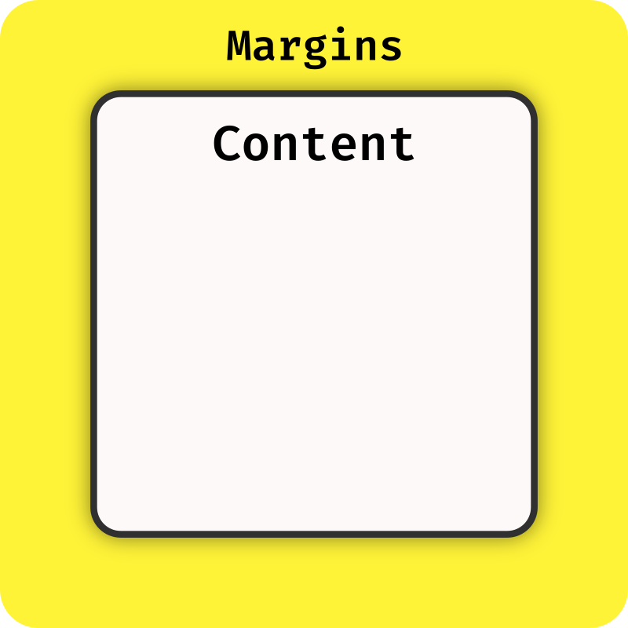
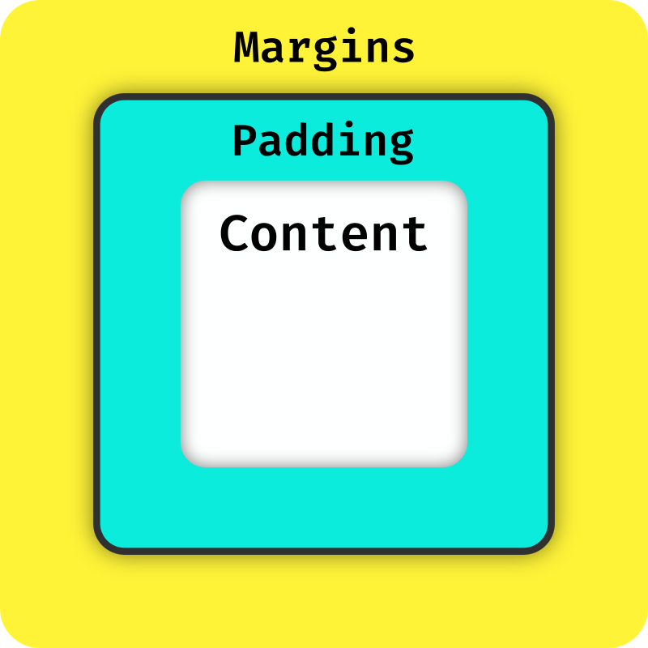

There are quite a few things to know about how components internally work and how their properties decide behavior. This page serves as a helpful reference for the most important concepts.

## Using the Inspector

Many properties of a component can be analyzed visually right in game, using the component inspector. While in debug mode, it can be enabled on any owo screen (or, more specifically, any UI adapter which can capture the relevant keyboard input) by pressing ++ctrl+shift++. You can then use your mouse to hover the component you wish to inspect. The text annotation presents information in the following format:

{ .center-image }

:fontawesome-solid-square:{ style="color: #554994;" } The type of the component  
:fontawesome-solid-square:{ style="color: #f675a8;" } The ID of the component (if defined)  
:fontawesome-solid-square:{ style="color: #046582;" } The absolute coordinates of the component  
:fontawesome-solid-square:{ style="color: #f39189;" } The actual size of the component  
:fontawesome-solid-square:{ style="color: #90c8ac;" } The margins of the component: `<top,bottom,left,right>`  
:fontawesome-solid-square:{ style="color: #73a9ad;" } The padding of the component (only on parent components)

Everything is given in logical pixels - that is, pixels after the UI Scale option is applied. If you wish the see the bounding boxes and margins of the entire UI tree, press ++alt+shift++ to bring the inspector into global mode.

## Margins

{ align=right style="--image-width: 30%;" .sized-image }

Each component defines a set of margins. These decide how much dead space to add around the component's main bounding box on each side - this is most often useful for spacing out neighboring components. Margins may also be negative, which effectively shrinks the bounding box of the component on that side, although results may sometimes be counterintuitive.

The inspector draws the margins of a component in bright yellow

## Padding

{ align=right style="--image-width: 30%;" .sized-image }

Every parent component defines padding. This decides how much dead space is added inside the component's bounding box, surrounding its children. If the component is not content-sized, this means the space available to its children becomes smaller. Just like margins, padding may be negative.

The inspector draws the padding of a component in bright cyan

## Sizing

The sizing of a component describes how its size should be calculated. There are three methods available, which you can apply independently on both axes:

- **Content** | :material-xml: `method="content"` :material-language-java: `Sizing.content()`

    A content-sized component is always as large as it needs to be to fit all of its content (plus some amount of padding, which you can specify). Not all components support this method, as they may not have an intrinsic size, and will throw an exception when configured this way.

- **Fill** | :material-xml: `method="fill"` :material-language-java: `Sizing.fill(...)`
    
    Fill-sizing dynamically makes the component fill the given percentage of the available space. If the parent of this component is content-sized, this means the available space will the that of the parent. If all parents are content-sized, the entire screen is regarded as available.

- **Fixed** | :material-xml: `method="fixed"` :material-language-java: `Sizing.fixed(...)`
    
    Fixed simply hard-defines the size of the component in pixels

## Positioning

The positioning of a component describes how it should be placed on the screen. Just as with sizing, there are three different types available:

- **Layout** | :material-xml: `type="layout"` :material-language-java: `Positioning.layout()`

    Layout positioning declares that this component wishes to be part of its parent's layout. This is a unique property - components with absolute and relative positioning are ignored during the layout process and always placed on the screen according to their positioning.

- **Relative** | :material-xml: `type="relative"` :material-language-java: `Positioning.relative(...)`

    A relatively positioning component gets placed the specified percentage across the parent - *including the component's own size*. This means that 50|50 makes the component centered and 100|100 pushes it all the way into the bottom right corner, but values between 0 and 100 can never make a component overflow

- **Absolute** | :material-xml: `type="absolute"` :material-language-java: `Positioning.absolute(...)`

    Absolute positioning is the most straight-forward - it simply places the component at the specified amount of pixels offset from the parent's origin.